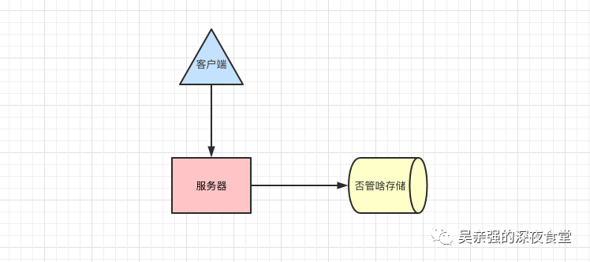
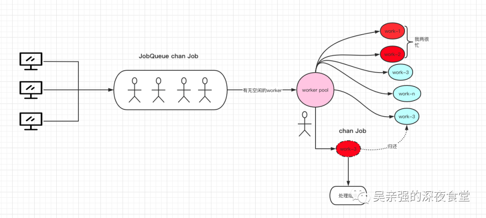
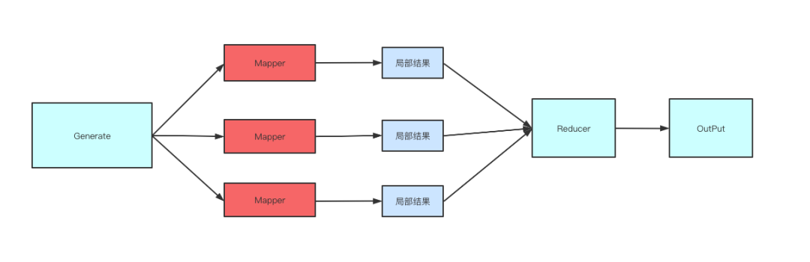

> 需求背景：
>
> 之江实验室智能视觉平台，是一个融合了各种智能视觉算法的平台。为了让用户高并发、高可用、分布式处理任务。需要将用户前台触发的各种任务分发到后面AI算法进行处理。


### 一、使用 Go 每分钟处理百万请求

项目的需求很简单，客户端发送请求，服务端接收请求处理数据(原文是把资源上传至 Amazon S3 资源中)。本质上就是这样



#### 初版

```go

package main

import (
  "fmt"
  "log"
  "net/http"
  "time"
)

type Payload struct {
  // 传啥不重要
}

func (p *Payload) UpdateToS3() error {
  //存储逻辑,模拟操作耗时
  time.Sleep(500 * time.Millisecond)
  fmt.Println("上传成功")
  return nil
}

func payloadHandler(w http.ResponseWriter, r *http.Request) {
  // 业务过滤
  // 请求body解析......
  var p Payload
  go p.UpdateToS3()
  w.Write([]byte("操作成功"))
}

func main() {
  http.HandleFunc("/payload", payloadHandler)
  log.Fatal(http.ListenAndServe(":8099", nil))
}
```

缺点：一个任务来了，就起一个G，CPU 使用率暴涨，内存占用暴涨......，直至程序奔溃。

如果此操作落地至数据库，例如mysql。相应的，你数据库服务器的磁盘IO、网络带宽 、CPU负载、内存消耗都会达到非常高的情况，一并奔溃。

####  中版

```go
package main

import (
  "fmt"
  "log"
  "net/http"
  "time"
)

const MaxQueue = 400

var Queue chan Payload

func init() {
  Queue = make(chan Payload, MaxQueue)
}

type Payload struct {
  // 传啥不重要
}

func (p *Payload) UpdateToS3() error {
  //存储逻辑,模拟操作耗时
  time.Sleep(500 * time.Millisecond)
  fmt.Println("上传成功")
  return nil
}

func payloadHandler(w http.ResponseWriter, r *http.Request) {
  // 业务过滤
  // 请求body解析......
  var p Payload
  //go p.UpdateToS3()
  Queue <- p
  w.Write([]byte("操作成功"))
}

// 处理任务
func StartProcessor() {
  for {
    select {
    case payload := <-Queue:
      payload.UpdateToS3()
    }
  }
}

func main() {
  http.HandleFunc("/payload", payloadHandler)
  //单独开一个g接收与处理任务
  go StartProcessor()
  log.Fatal(http.ListenAndServe(":8099", nil))
}
```

改进：增加了一个 带 buffered 的 channel 来完成这个功能，可以避免无限制的G。

缺点：高并发下请求进来的速度会远远超过处理的速度，那么 channel 满了之后， 后续的请求将会被阻塞等待。

最终版

```go
package main

import (
	"fmt"
	"log"
	"net/http"
	"strconv"
	"time"
)

const (
	MaxWorker = 5 //随便设置值
	MaxQueue  = 200 // 随便设置值
)

type Payload struct{}

type Job struct {
	PayLoad Payload
}

// 一个可以发送工作请求的缓冲 channel
var JobQueue chan Job

func init() {
	JobQueue = make(chan Job, MaxQueue)
}

type Worker struct {
	name string
	WorkerPool chan chan Job
	JobChannel chan Job
	quit       chan bool
}

func NewWorker(workerPool chan chan Job,name string) Worker {
	return Worker{
		name: name,
		WorkerPool: workerPool,
		JobChannel: make(chan Job),
		quit:       make(chan bool),
	}
}

// Start 方法开启一个 worker 循环，监听退出 channel，可按需停止这个循环
func (w Worker) Start() {
	go func() {
		for {
			// 将当前的 worker 注册到 worker 队列中
			fmt.Println(w.name,"start...",len(w.WorkerPool))
			w.WorkerPool <- w.JobChannel
			fmt.Println(w.name,"register...",len(w.WorkerPool))
			select {
			case job := <-w.JobChannel:
				//   真正业务的地方
				//  模拟操作耗时
				time.Sleep(50 * time.Millisecond)
				fmt.Printf("上传成功:%v\n", job)
			case <-w.quit:
				return
			}
		}
	}()
}

func (w Worker) stop() {
	go func() {
		w.quit <- true
	}()
}

// 初始化操作

type Dispatcher struct {
	// 注册到 dispatcher 的 worker channel 池
	WorkerPool chan chan Job
}

func NewDispatcher(maxWorkers int) *Dispatcher {
	pool := make(chan chan Job, maxWorkers)
	return &Dispatcher{WorkerPool: pool}
}

func (d *Dispatcher) Run() {
	// 开始运行 n 个 worker
	for i := 0; i < MaxWorker; i++ {
		name := "work"+strconv.Itoa(i)
		worker := NewWorker(d.WorkerPool,name)
		worker.Start()
	}
	go d.dispatch()
}

func (d *Dispatcher) dispatch() {
	for {
		select {
		case job := <-JobQueue:
			go func(job Job) {
				// 尝试获取一个可用的 worker job channel，阻塞直到有可用的 worker
				fmt.Println("dispath before",len(d.WorkerPool))
				jobChannel := <-d.WorkerPool
				fmt.Println("dispath after",len(d.WorkerPool))
				// 分发任务到 worker job channel 中
				jobChannel <- job
			}(job)
		}
	}
}

// 接收请求，把任务筛入JobQueue。
func payloadHandler(w http.ResponseWriter, r *http.Request) {
	work := Job{PayLoad: Payload{}}
	JobQueue <- work
	_, _ = w.Write([]byte("操作成功"))
}

func main() {
	// 通过调度器创建worker，监听来自 JobQueue的任务
	d := NewDispatcher(MaxWorker)
	d.Run()
	http.HandleFunc("/payload", payloadHandler)
	log.Fatal(http.ListenAndServe(":8099", nil))
}

```

最终采用的是两级 channel，一级是将用户请求数据放入到 chan Job 中，这个 channel job 相当于待处理的任务队列。

另一级用来存放可以处理任务的 work 缓存队列，类型为 chan chan Job。调度器把待处理的任务放入一个空闲的缓存队列当中，work 会一直处理它的缓存队列。通过这种方式，实现了一个 worker 池。大致画了一个图帮助理解.




代码流程：1.在接收到一个请求后，创建 Job 任务，把它放入到任务队列中等待 work 池处理。

2.Dispatcher 会给这个 Job 一个  jobChannel 放任务

```go
jobChannel := <-d.WorkerPool
```

3.worker 有一个work loop ，拿到任务就处理了。

#### 是否采用：

能满足单机版的任务，无法满足分布式任务。work 数量不能无限大，会占用很大一部分内存。所以对于计算机视觉处理任务来说，一个job可能需要 1个小时，这样一个小时内发送海量任务，肯定会把work使用完。


#### 参考链接

[使用 Go 每分钟处理百万请求](https://mp.weixin.qq.com/s?__biz=MzkyMzIwMDcyOA==&mid=2247484021&idx=1&sn=70684eb6c73723dad3e23493cdd98b6f&chksm=c1e9ffc2f69e76d4b255e508f98c2bb80d3247fcbdd0341e6992921fe6fb1a2066ab09c2e33b&scene=21#wechat_redirect)

[英文原文链接](http://marcio.io/2015/07/handling-1-million-requests-per-minute-with-golang/)


### 二、如何在 go 中实现一个 worker-pool?

相比于上一篇文章，本文代码更加抽象，而且增加了通过`context.context`控制机制可以优雅退出，并且对处理结果进一步聚合。



下面是整体流程


#### job 定义

```go
type JobID string
type jobType string
type jobMetadata map[string]interface{}

type ExecutionFn func(ctx context.Context, args interface{}) (interface{}, error)

type JobDescriptor struct {
	ID       JobID
	JType    jobType
	Metadata map[string]interface{}
}

type Result struct {
	Value      interface{}
	Err        error
	Descriptor JobDescriptor
}

type Job struct {
	Descriptor JobDescriptor
	ExecFn     ExecutionFn
	Args       interface{}
}

func (j Job) execute(ctx context.Context) Result {
	value, err := j.ExecFn(ctx, j.Args)
	if err != nil {
		return Result{
			Err:        err,
			Descriptor: j.Descriptor,
		}
	}

	return Result{
		Value:      value,
		Descriptor: j.Descriptor,
	}
}
```

#### work定义

```go

func worker(ctx context.Context, wg *sync.WaitGroup, jobs <-chan Job, results chan<- Result) {
	defer wg.Done()
	for {
		select {
		case job, ok := <-jobs:
			if !ok {
				return
			}
			// fan-in job execution multiplexing results into the results channel
			results <- job.execute(ctx)
		case <-ctx.Done():
			fmt.Printf("cancelled worker. Error detail: %v\n", ctx.Err())
			results <- Result{
				Err: ctx.Err(),
			}
			return
		}
	}
}

type WorkerPool struct {
	workersCount int
	jobs         chan Job
	results      chan Result
	Done         chan struct{}
}

func New(wcount int) WorkerPool {
	return WorkerPool{
		workersCount: wcount,
		jobs:         make(chan Job, wcount),
		results:      make(chan Result, wcount),
		Done:         make(chan struct{}),
	}
}

func (wp WorkerPool) Run(ctx context.Context) {
	var wg sync.WaitGroup

	for i := 0; i < wp.workersCount; i++ {
		wg.Add(1)
		// fan out worker goroutines
		//reading from jobs channel and
		//pushing calcs into results channel
		go worker(ctx, &wg, wp.jobs, wp.results)
	}

	wg.Wait()
	close(wp.Done)
	close(wp.results)
}

func (wp WorkerPool) Results() <-chan Result {
	return wp.results
}

func (wp WorkerPool) GenerateFrom(jobsBulk []Job) {
	for i, _ := range jobsBulk {
		wp.jobs <- jobsBulk[i]
	}
	close(wp.jobs)
}
```

#### 是否采用

推荐，对于任务类型和任务执行方法可以自定义，

#### 参考链接

[如何在 go 中实现一个 worker-pool?](https://mp.weixin.qq.com/s?__biz=MzkyMzIwMDcyOA==&mid=2247484933&idx=1&sn=d6e065fa200f893d9d3ac00cba1ef053&chksm=c1e9fbb2f69e72a4b7a0226103208687cf2fccb9ce4166b80c6d72bb7d55d39c6a55773ca4e5&scene=178&cur_album_id=1839626058342400002#rd)

[英文原文链接](https://itnext.io/explain-to-me-go-concurrency-worker-pool-pattern-like-im-five-e5f1be71e2b0#fe56)

### 三、Demo on creating worker pool in GoLang

> 通过 chan queue 作为任务队列，work 数组作为并发数量，通过StopChan 停止任务

Pool.go

```go
package pool

import (
	"demo1/pkg/work"
	"fmt"
	"sync"
)

// Pool ...
type Pool struct {
	Name string

	Size    int
	Workers []*work.Worker

	QueueSize int
	Queue     chan work.Job
}

// Initialize  ...
func (p *Pool) Initialize() {
	// maintain minimum 1 worker
	if p.Size < 1 {
		p.Size = 1
	}
	p.Workers = []*work.Worker{}
	for i := 1; i <= p.Size; i++ {
		worker := &work.Worker{
			ID:   i - 1,
			Name: fmt.Sprintf("%s-worker-%d", p.Name, i-1),
		}
		p.Workers = append(p.Workers, worker)
	}

	// maintain min queue size as 1
	if p.QueueSize < 1 {
		p.QueueSize = 1
	}
	p.Queue = make(chan work.Job, p.QueueSize)
}

// Start ...
func (p *Pool) Start() {
	for _, worker := range p.Workers {
		worker.Start(p.Queue)
	}
	fmt.Println("all workers started")
}

// Stop ...
func (p *Pool) Stop() {
	close(p.Queue) // close the queue channel

	var wg sync.WaitGroup
	for _, worker := range p.Workers {
		wg.Add(1)
		go func(w *work.Worker) {
			defer wg.Done()

			w.Stop()
		}(worker)
	}
	wg.Wait()
	fmt.Println("all workers stopped")
}
```

Work.go

```go
package work

import "fmt"

// Worker ...
type Worker struct {
	ID       int
	Name     string
	StopChan chan bool
}

// Start ...
func (w *Worker) Start(jobQueue chan Job) {
	w.StopChan = make(chan bool)
	successChan := make(chan bool)

	go func() {
		successChan <- true
		for {
			// take job
			job := <-jobQueue
			if job != nil {
				job.Start(w)
			} else {
				fmt.Printf("worker %s to be stopped\n", w.Name)
				w.StopChan <- true
				break
			}
		}
	}()

	// wait for the worker to start
	<-successChan
}

// Stop ...
func (w *Worker) Stop() {
	// wait for the worker to stop, blocking
	_ = <-w.StopChan
	fmt.Printf("worker %s stopped\n", w.Name)
}

// Job ...
type Job interface {
	Start(worker *Worker) error
}

```

#### 参考链接

[一个 demo 学会 workerPool](https://mp.weixin.qq.com/s/YCl7r7l3Ty3wbnImVWRLxg)

[英文原文链接](https://www.pixelstech.net/article/1611483826-Demo-on-creating-worker-pool-in-GoLang)

###  四、The Case For A Go Worker Pool


#### 1. Base case

~~~ go
package main

import (
	"fmt"
	"time"
)

func worker(id int, jobs <-chan int, results chan<- int) {
	for j := range jobs {
		fmt.Println("worker", id, "processing job", j)
		time.Sleep(time.Second)
		results <- j * 2
	}
}

func main() {
	jobs := make(chan int, 100)
	results := make(chan int, 100)

	for w := 1; w <= 3; w++ {
		go worker(w, jobs, results)
	}

	for j := 1; j <= 9; j++ {
		jobs <- j
	}
	close(jobs)

	for a := 1; a <= 9; a++ {
		<-results
	}
}

~~~


#### 2.增加错误处理

> 该版本有bug，如果设置 errors := make(chan error, 1)  会产生死锁。

~~~go
package main

import (
	"fmt"
	"sync"
	"time"
)

func worker(id int, wg *sync.WaitGroup, jobs <-chan int, results chan<- int, errors chan<- error) {
	for j := range jobs {
		fmt.Println("worker", id, "processing job", j)
		time.Sleep(time.Second)

		if j%2 == 0 {
			results <- j * 2
		} else {
			errors <- fmt.Errorf("error on job %v", j)
		}
		wg.Done()
	}
}

func main() {
	jobs := make(chan int, 100)
	results := make(chan int, 100)
	errors := make(chan error, 100)

	var wg sync.WaitGroup
	for w := 1; w <= 3; w++ {
		go worker(w, &wg, jobs, results, errors)
	}

	for j := 1; j <= 9; j++ {
		jobs <- j
		wg.Add(1)
	}
	close(jobs)

	wg.Wait()

	select {
	case err := <-errors:
		fmt.Println("finished with error:", err.Error())
	default:
	}
}
~~~


#### 3.更健壮版本

```go
package main

import (
	"fmt"
	"sync"
)

// Pool is a worker group that runs a number of tasks at a
// configured concurrency.
type Pool struct {
	Tasks []*Task

	concurrency int
	tasksChan   chan *Task
	wg          sync.WaitGroup
}

// NewPool initializes a new pool with the given tasks and
// at the given concurrency.
func NewPool(tasks []*Task, concurrency int) *Pool {
	return &Pool{
		Tasks:       tasks,
		concurrency: concurrency,
		tasksChan:   make(chan *Task),
	}
}

// Run runs all work within the pool and blocks until it's
// finished.
func (p *Pool) Run() {
	for i := 0; i < p.concurrency; i++ {
		go p.work()
	}

	p.wg.Add(len(p.Tasks))
	for _, task := range p.Tasks {
		p.tasksChan <- task
	}

	// all workers return
	close(p.tasksChan)

	p.wg.Wait()
}

// The work loop for any single goroutine.
func (p *Pool) work() {
	for task := range p.tasksChan {
		task.Run(&p.wg)
	}
}

// Task encapsulates a work item that should go in a work
// pool.
type Task struct {
	id int
	// Err holds an error that occurred during a task. Its
	// result is only meaningful after Run has been called
	// for the pool that holds it.
	Err error

	f func() error
}

// NewTask initializes a new task based on a given work
// function.
func NewTask(f func() error, rid int) *Task {
	return &Task{
		id: rid,
		f:  f}
}

// Run runs a Task and does appropriate accounting via a
// given sync.WorkGroup.
func (t *Task) Run(wg *sync.WaitGroup) {
	t.Err = t.f()
	fmt.Println("run task ", t.id)
	wg.Done()
}

func main() {
	tasks := []*Task{
		NewTask(func() error { return nil }, 1),
		NewTask(func() error { return nil }, 2),
		NewTask(func() error { return nil }, 3),
	}

	p := NewPool(tasks, 5)
	p.Run()

	var numErrors int
	for _, task := range p.Tasks {
		if task.Err != nil {
			fmt.Println(task.Err.Error())
			numErrors++
		}
		if numErrors >= 10 {
			fmt.Println("Too many errors.")
			break
		}
	}
}

```

#### 参考链接

[Go Work Pool 几个典型例子](https://brandur.org/go-worker-pool)

> 同例子三类似，一个task数组存放任务并同步到 task channel中，一个pool确定并发的数量。


### 五、workPool

[Go语言的并发与WorkerPool - 第一部分](https://mp.weixin.qq.com/s/5pQS82nE9ivF6NjaXFsolQ)

> 串行处理耗时太大--->无限并发处理内存消耗大-->work pool 平衡

[Go语言的并发与WorkerPool - 第二部分](https://mp.weixin.qq.com/s?__biz=MzI2MDA1MTcxMg==&mid=2648468414&idx=1&sn=8efed31baa411f2e63e4fe043f207c41&chksm=f2474dd1c530c4c71f94dda44bb97201164df4a9730a5045534cdf354b54b096321e1f1b91a7&cur_album_id=1506050738668486658&scene=189#rd)

> 第一部分的升级版，增加了错误处理、退出信号 ，比较特别的是增加了长连接任务。

源码GitHub：https://github.com/Joker666/goworkerpool


**1.以上只针对 生产者-消费者 同类型任务模型，如果有不同类型的task，该怎么办？**

> 1.可以通过统一grpc方法，由一个双流方法发送接收一个统一的message结构体，屏蔽了不同方法的差异。（这样不同的算法就可以放在一个task queue里面，不用放在不同的queue channel里面）
>
> 再封装一个分发的接口，负责发送到不同的后端算法，避免A任务发送到B后端。

~~~go
type Task struct {
	Err  error
	Data interface{}
	f    func(interface{}) error
}
~~~

通过在Task结构体里面，定义一个成员函数，可以让不同的task做不同的事情。

**2.如果worker处理任务方式不一样，怎么办？**

> task定义一个 f 参数，参数传入一个func ，对应不同的worker。

**3.如果生产者速度，大于消费者速度，造成了，产品堆积，超过了channel的缓冲区，怎么办？**

1.加入grpc的主动健康检测机制，服务不可用会停止生产  **生产者限流**

2.task buffer满了，会阻塞传入。 

3.采用redis消息队列处理，redis会把未处理的任务持久化。然后一个个消费。如果redis消息堆积，可以定义消息长度，来丢弃消息：中间件丢弃旧消息，只保留固定长度的新消息

**4.如果生产者(worker)数量是动态的，怎么办？**

> 统一message结构体后，任务就没有类型的区分，worker也没有类型之分，worker的数量就是并发量，可以自定义设置。


### 六、任务队列

1.taskq （解决高并发场景）

>  Golang asynchronous task/job queue with Redis, SQS, IronMQ, and in-memory backends
>
>  用 redis、SQS、IronMQ、缓存作为后端的 Golang 异步 task/job 队列
>
> https://github.com/vmihailenco/taskq

2.work pool 和 task queue 结合

https://gist.github.com/harlow/dbcd639cf8d396a2ab73

### 七、一文带你搞懂从单队列到优先级队列的实现

https://mp.weixin.qq.com/s/eXJcjPnXiy733k79Y1vbBg


### 参考链接

[Golang 任务队列策略 -- 读《JOB QUEUES IN GO》](https://blog.csdn.net/zhizhengguan/article/details/107358568)

[Golang队列中间件开发总结](https://blog.csdn.net/qq_30145355/article/details/82322238?utm_medium=distribute.pc_relevant.none-task-blog-2%7Edefault%7EsearchFromBaidu%7Edefault-4.pc_relevant_baidujshouduan&depth_1-utm_source=distribute.pc_relevant.none-task-blog-2%7Edefault%7EsearchFromBaidu%7Edefault-4.pc_relevant_baidujshouduan)

[golang中job队列实现方法](https://blog.csdn.net/wdy_yx/article/details/78964267)

https://twinnation.org/articles/39/go-concurrency-goroutines-worker-pools-and-throttling-made-simple


### 八、企业级 goroutine 池

> ants是一个高性能的 goroutine 池，实现了对大规模 goroutine 的调度管理、goroutine 复用，允许使用者在开发并发程序的时候限制 goroutine 数量，复用资源，达到更高效执行任务的效果。

[ants github 地址](https://github.com/panjf2000/ants/blob/master/README_ZH.md)


[Goroutine 并发调度模型深度解析之手撸一个高性能 Goroutine 池](https://www.infoq.cn/article/XF6v3Vapqsqt17FuTVst)