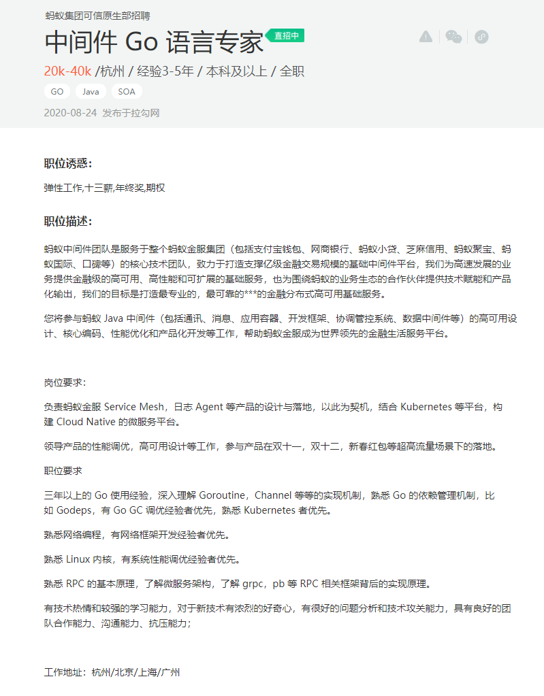
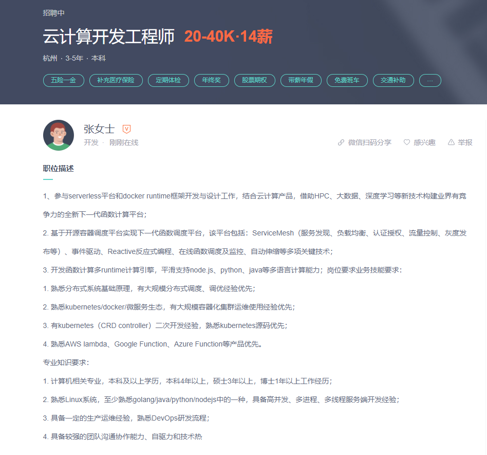
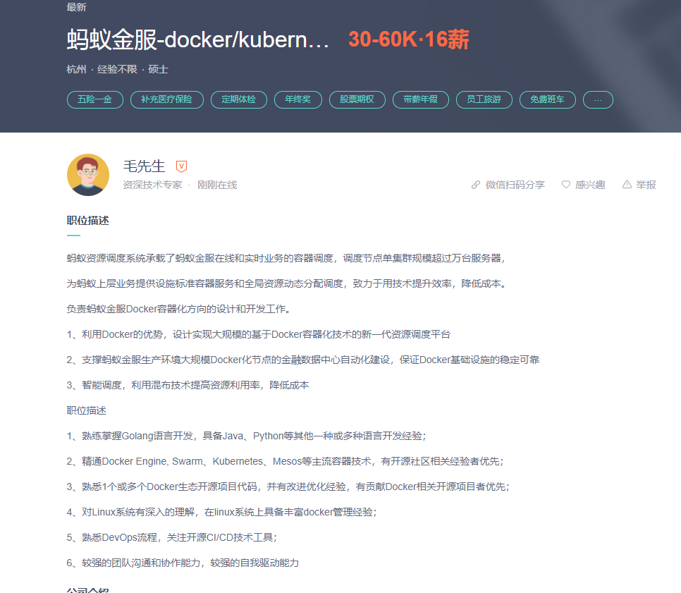

## 待点亮的技能

------

* **深入理解 Goroutine，Channel 等等的实现机制**
* ***有 Go GC 调优经验者优先***
* ***熟悉 Kubernetes 者优先***
* ***熟悉网络编程，有网络框架开发经验者优先。***
* ***熟悉 Linux 内核，有系统性能调优经验者优先。***
* **熟悉 RPC 的基本原理，了解微服务架构，了解 grpc，pb 等 RPC 相关框架背后的实现原理。**

------

------

* **熟悉分布式系统基础原理，有大规模分布式调度、调优经验优先；**

* **熟悉kubernetes/docker/微服务生态，有大规模容器化集群运维使用经验优先；**

* **有kubernetes（CRD controller）二次开发经验，熟悉kubernetes源码优先；**

* **熟悉k8s配套工具，如kubectl、kustomize、kubebuilder，operator。**

* **熟悉AWS lambda、Google Function、Azure Function等产品优先。**

  ------

------

* 精通Docker Engine, Swarm、Kubernetes、Mesos等主流容器技术，有开源社区相关经验者优先；
* 熟悉1个或多个Docker生态开源项目代码，并有改进优化经验，有贡献Docker相关开源项目者优先；
* 对Linux系统有深入的理解，在linux系统上具备丰富docker管理经验；

------

* 熟悉Linux常用工具和命令，较好的诊断调优技能

## 解决过比较复杂的问题

### 科学计数法

### app标签

### 编译项目时遇到的坑

* CGO_ENABLED="0" 和 sqlite 不可兼容

> CGO_ENABLED="0"编译的代码连接不上sqlite，但是CGO_ENABLED="1"的代码容器又无法运行

### websocket 不支持并发

* gorilla websocket不支持多个客户端并发